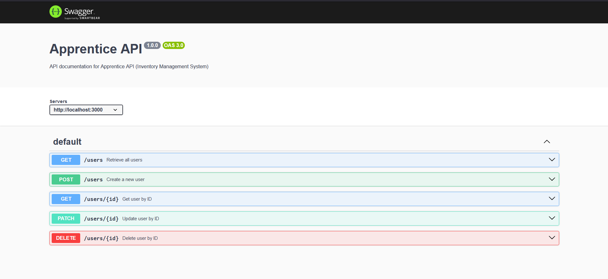

# Apprentice

A Full-stack Inventory Management Application (IMS) created using MERN (MongoDB, Express, React, and Node) stack, as well as Typescript and Tailwind.

> [!Important]
>
> Application in progress.

### Todo

- [x] auth
- [] rbac
- [] admin crud for warehouse
- [] admin crud for users
- [] admin transactions / graphs
- [] admin logs / recent activities
- [] admin settings
- [] staff crud for items
- [] staff transactions / graphs
- [] staff low stock / near expiry
- [] staff settings
- [] staff generate excel report of items
- [] recursive aggregation pipeline

## Features

Enhanced Visibility and Control:

    - Track inventory levels across various locations (warehouses, stores).
    - Monitor product movement (inflow, outflow, transfers) for better stock control.
    - Identify low-stock items and trigger automated reordering to prevent stockouts.

Optimized Inventory Management:

    - Implement inventory forecasting techniques to anticipate demand and adjust stock levels accordingly.
    - Analyze inventory data to identify and optimize product placement, and reduce shrinkage (loss of stock due to various factors).
    - Reduce costs associated with overstocking, understocking, and obsolescence (expired or outdated products).

## Screenshots

